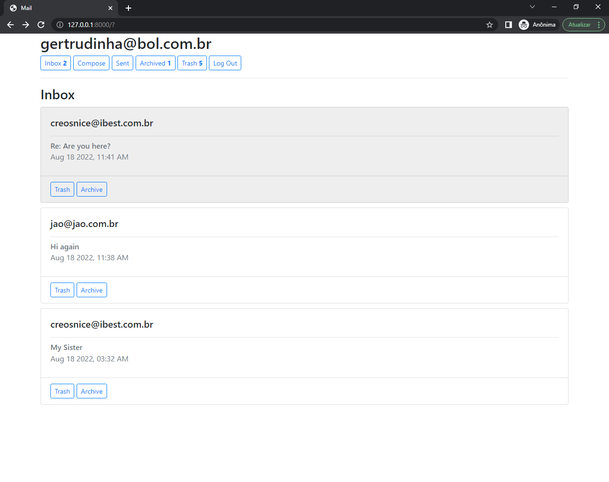
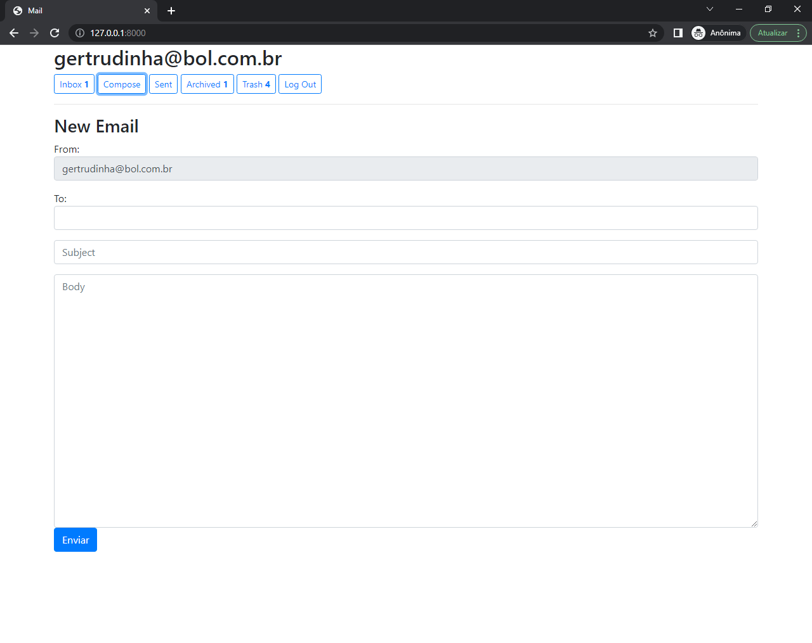
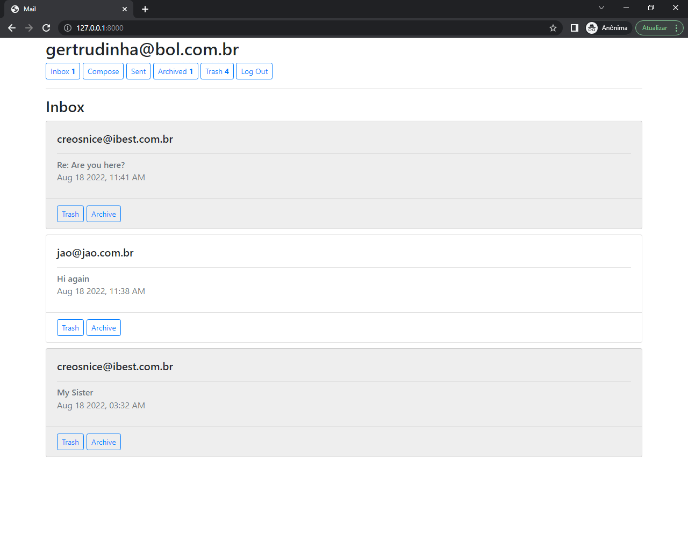
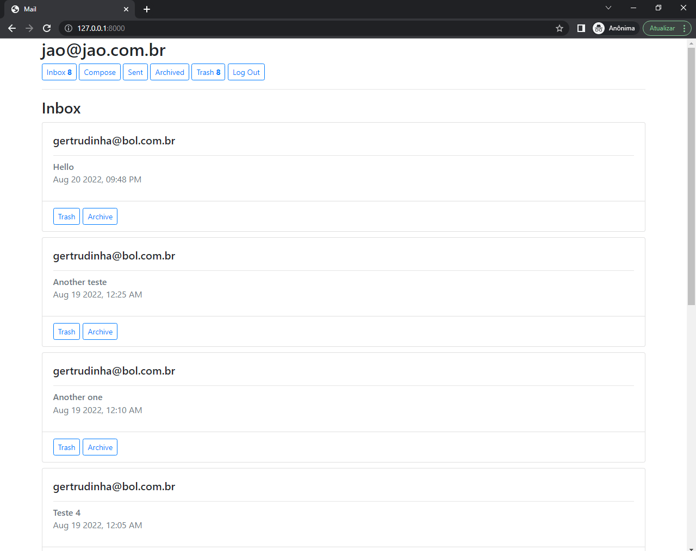
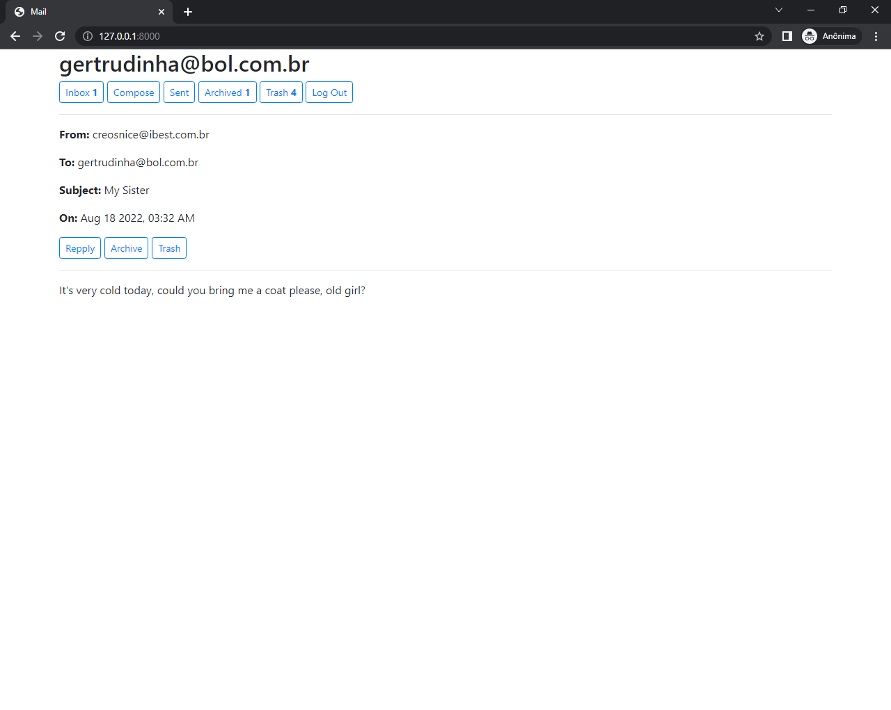
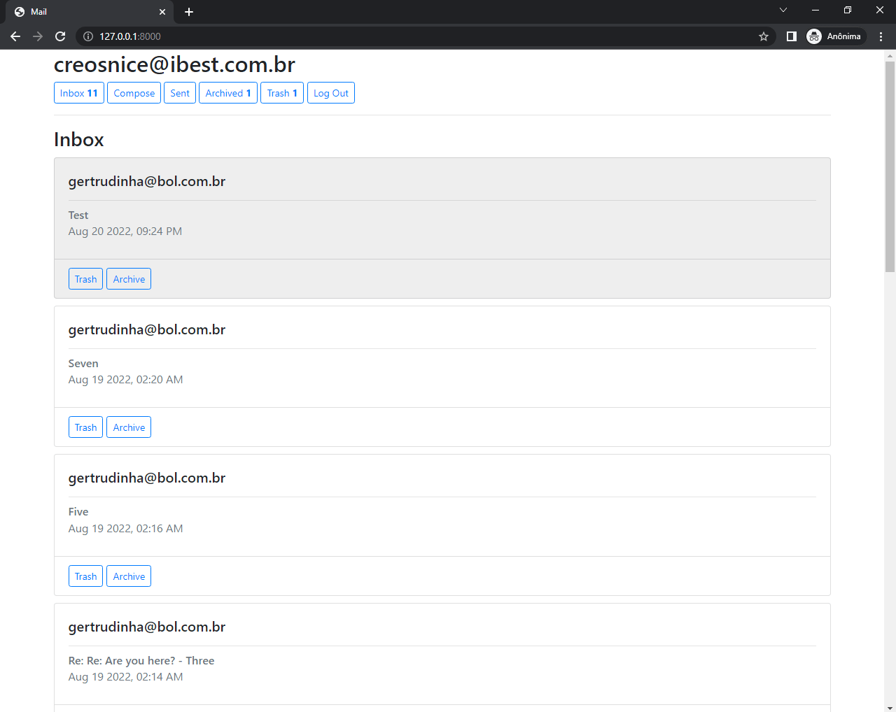

# Project 3 - Mail, CS50 Web
#### Video Demo:  
<https://www.youtube.com/watch?v=z1ogNGJsSlE>

## Index
* [Title and Logo](#Title-and-Logo)
* [Badges](#badges)
* [Index](#index)
* [Project Description](#project-description)
* [Project Status](#project-status)
* [Application, Features and Requirements](#application-features-and-requirements)
* [Details](#details)
* [Developer](#developer)
* [Conclusion](#conclusion)

## Project Description

 The Project 3 of the CS50 Web is called <b>Mail</b>. We must design a front-end for an email client that makes <b>API</b> calls to send and receive emails. The new demand or the new requirement now for this stage is that we must write our program using only one page for this, something called <b>single-page-app</b>.

## Project Status

It was tested a lot. But it always has one or other lacks.

## Application, Features and Requirements

Once again we're going to work with Django, but it is important to emphasize that the course asks us to complete this project by just writing <b>HTML</b>, <b>CSS</b> and <b>JavaScript</b>. In fact, we are going to write almost the entire program just in <b>JavaScript</b>.

## Details

Below, all the details about this project:

### Send Mail

We must add JavaScript code to actually <b>send</b> the email when a user submits the email composition form...

- `1`) making a POST request to <b>/emails</b> and passing in values for <b>recipients</b>, <b>subject</b>, and <b>body</b>.
- `2`) After this, the user’s <b>sent mailbox</b> will be loaded.

### Mailbox

When a user visits a mailbox, the appropriate function will recognize which one is required...

- `1`) making a GET request to <b>/emails/`<mailbox>`</b> ir order to request the right emails for each mailbox.
- `2`) Also in this right moment, the application queries the API for the latest emails in that mailbox,
- `3`) besides showing its name at the top of the page.
- `4`) Each email is rendered in its <b>own box</b> that displays <b>who sent</b> it, what is the <b>subject</b> and <b>when</b> the email was sent.
- `5`) For the <b>unread emails</b> the <b>background is white</b>, while for the emails that already were <b>read the background is gray</b>.

### View Email

Clicking on an email, the user is taken to a <b>view</b> where the content of that email is shown.

- `1`) This is possible because the application makes a GET request to <b>/emails/`<email_id>`</b> to request the email.
- `2`) In this view, the email’s <b>sender</b>, <b>recipients</b>, <b>subject</b>, <b>timestamp</b>, and <b>body</b> are displayed.
- `3`) An additional <b>div</b> was put inside to <b>inbox.html</b> in order to hide and show this part, according to our JavaScript code.
- `4`) As we have already seen, each email is rendered in its <b>own box</b> and each <b>box</b> is sensible to click or <b>clickable</b>, so to speak. Each box, then, evoques the <b>view_email</b> function with its <b>email_id</b>. After that, this view is added to the <b>DOM</b> or, in other words, is <b>appended</b> to the additional <b>div</b> that was put inside the <b>inbox.html</b> with the command <b>document.querySelector('#view-email').append(view)</b> so that we can see it on screen.
- `5`) When an email is clicked, it is categorized by the application as <b>read</b>. Sending a <b>PUT</b> request to <b>/emails/`<email_id>`</b>, we can update this new condition.

### Archive and Unarchive

The application allows users <b>archive</b> and <b>unarchive</b> emails.

- `1`) When viewing an Inbox email, we can archive the email directly in the <b>inbox</b> or when we <b>view</b> this specific email. If we go to the <b>archive</b> box, we can <b>unarchive</b> an email if we want. The exercise asks us to don't enable this feature for the <b>sent</b> emails.
- `2`) It is possible because we send a <b>PUT</b> request to <b>/emails/`<email_id>`</b> updating the <b>archive</b> or <b>unarchive</b> conditions.
- `3`) After each <b>archive</b> or <b>unarchive</b> action, the user's inbox is loaded.

### Reply

Another functionality that is required is the possibiliy to the users <b>reply</b> emails.

- `1`) It is be presented a <b>reply</b> button when viewing an email.
- `2`) When the <b>reply</b> button is clicked, users are taken to the email composition form,
- `3`) with this composition form pre-filled and the <b>recipient</b> field set to whoever sent the original email.
- `4`) The <b>subject</b> line is pre-filled with the word <b>Re:</b> followed by the <b>original subject</b>.
- `5`) Also the <b>body</b> of the <b>replier email</b> is pre-filled with the content from the original one. In this case, the <b>timestamp</b> and the <b>email address to be replied</b> will appear before the new content, to be written, composing the following sentence <b>"On Jan 1 2020, 12:00 AM foo@example.com wrote:"</b>.

### Trash and Delete

I thought it was important the application presenting to the users the functionality for <b>deleting</b> an email. First taking it to a particular mailbox called <b>trash</b> and, then, the possibility to permanently <b>delete</b> it if users want. The exercise doesn't ask this part, but I tried to implement it. In order to do this, I had to create another <b>Boolean field</b> for the existing <b>model</b> and I called it <b>recycled</b>. I also had to insert some new code lines into the body of the <b>views.py</b>, as well to  create another kind of <b>fetch</b> which I called <b>DEL</b>. The <b>trash</b> button appears in all other mailboxes and also when we view an email. In the <b>trash</b> mailbox, we will see <b>three</b> buttons:

- `1`) The <b>Restore</b> button takes the email to its origin mailbox.
- `2`) The <b>Archive</b> button takes the email to the archive mailbox. This button isn't available for the emails which come from the sent mailbox, therefore for these emails only two buttons, <b>Restore</b> and <b>Delete</b>, will be shown in the trash mailbox.
- `3`) The <b>Delete</b> button will exclude the email after the safety confirmation.

## Developer
My name is Raphael Freitas. I'm Brazilian, I'm from Lorena (my city) São Paulo (my state) and my contact is raphaeuaf@yahoo.com.br.

## Conclusion

I want to thank <b>Harvard University / EDX</b> for this oportunity. I am really, really grateful.
